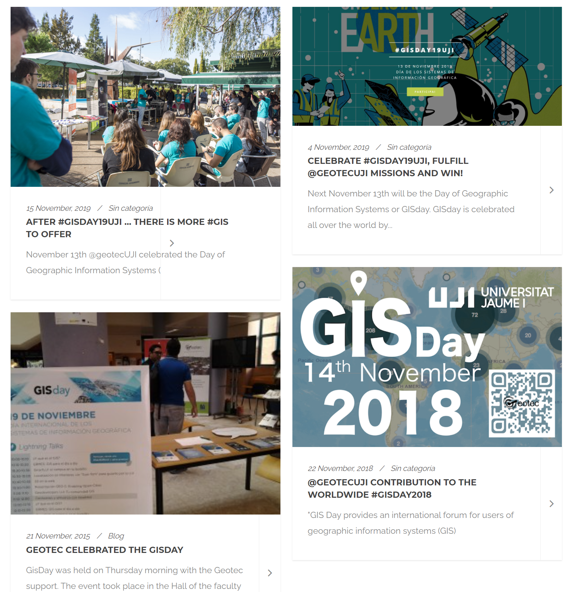

```{r setup, include=FALSE}
options(htmltools.dir.version = FALSE)
#devtools::install_github("hadley/emo")
# devtools::install_github("rstudio/fontawesome")
library(emo)
library(fontawesome) # from github: https://github.com/rstudio/fontawesome
```

layout: true
  
<div class="my-footer"><span><a href="https://geotecinit.github.io/GISDay2020/index.html">geotecinit.github.io/GISDay2020</a></span></div>

---
class: center


<!------------------------->
<!-- BLOQUE INTRODUCCIÓN -->
<!------------------------->
---
class: inverse, center, middle

# GISDay 2020

---
# .center[¿Qué se celebra el 18 noviembre?]

.center[Día Europeo para la protección de los niños de la explotación sexual]

--

.center[Día Mundial de los Record Guinness]

--

.center[Día Europeo del uso prudente de antibióticos]

--

.center[Día Internacional del Arte Islámico]

--

.center[.large[Día del Sistema de Información Geográfica `r emo::ji("earth")` - [GIS Day](https://www.gisday.com/)]]


???

Concienciar de la importancia que la geografía desempeña en nuestras vidas, y promover la profundización del tema en las escuelas, comunidades y organizaciones. [Wikipedia](https://es.wikipedia.org/wiki/GIS_Day)

---


.left-column[
  ### GISDay y GEOTEC
]

.right-column[
.center[]
]


---

.left-column[
  ### GISDay y GEOTEC
  ### GISDay 2019
]

.right-column[
.center[]
]


---

.left-column[
  ### GISDay y GEOTEC
  ### GISDay 2019
  ### GISDay 2020
]

.right-column[]


---


.left-column[
  ### GISDay y GEOTEC
  ### GISDay 2019
  ### GISDay 2020
]

.right-column[
.pull-left[.top[]]

.pull-right[.bottom[]] 

]


<!------------------------->
<!-- BLOQUE PRINCIPAL    -->
<!------------------------->
---
class: inverse, center, middle

# Tecnologías GIS emergentes

--

### [¿Como pueden ayudaros en la agricultura/medio ambiente]() 

---

.left-column[
  ### GIS y maps
]

.right-column[
* Contar historias
* Encontrar respuestas desde una nueva prespectiva
* Hacernos nuevas preguntas
]

---

.left-column[
  ### GIS y maps
]

.right-column[
Muchos tipos de datos.... Imagen aqui]


---

.left-column[
  ### GIS y maps
]

.right-column[
* Datos pare valorar, monitorizar, tomar decision
]


---

.left-column[
  ### GIS y maps
]

.right-column[
Nos centramos en datos de **Observacion de la Tierra**]


<!------------------------->
<!-- BLOQUE CIERRE       -->
<!------------------------->
---
class: inverse, center, middle

# Sumario

---

# Contenido bloque


---
class: right, middle

### Find GEOTEC at...

[`r fontawesome::fa(name = "link")` geotec](http://geotec.uji.es/)  

### Find me at...

[`r fontawesome::fa(name = "github")` @cgranell](http://github.com/cgranell)  
[`r fontawesome::fa(name = "link")` carlosgranell.eu](https://carlosgranell.eu)  
[`r fontawesome::fa(name = "paper-plane")` carlos.granell@uji.es](mailto:carlos.granell@uji.es)

### Find slides at...

[`r fontawesome::fa(name = "link")` geotecinit/GISDay2020](https://geotecinit.github.io/GISDay2020/index.html)  

### Find sources at...

[`r fontawesome::fa(name = "github")` github.com/GeoTecINIT/GISDay2020](https://github.com/GeoTecINIT/GISDay2020)  


