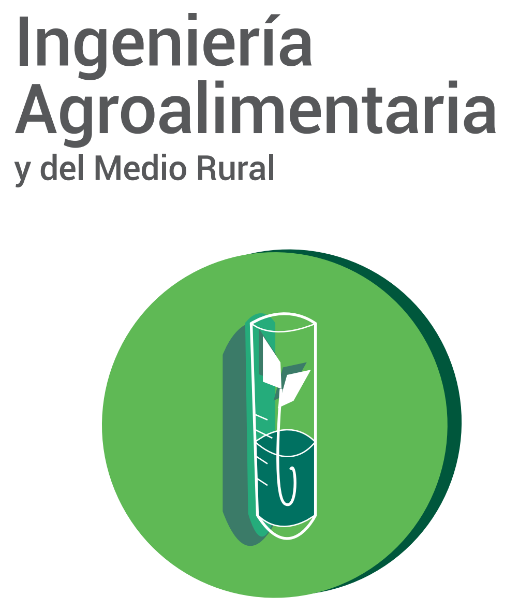

```{r setup, include=FALSE}
options(htmltools.dir.version = FALSE)
library(knitr)
knitr::opts_chunk$set(warning = FALSE, message = FALSE)
# devtools::install_github("hadley/emo")
# devtools::install_github("rstudio/fontawesome")
library(emo)
library(fontawesome) # from github: https://github.com/rstudio/fontawesome
```

layout: true
  
<div class="my-footer"><span>geotecinit.github.io/GISDay2020</span></div>

<!-- this adds the link footer to all slides, depends on my-footer class in css-->

---
name: title
class: left, middle
background-image: url(figs/Sentinel-2A.jpg)
background-size: cover

# .whiteinline[GIS Day]

<br/><br/>

### .whiteinline[.fancy[Observando desde el espacio: <br>agricultura y medio ambiente]]

<br/><br/><br/>

.right[.large[Carlos Granell & Estefanía Aguilar]]
.right[.large[GEOTEC | INIT | UJI]]
.right[18 noviembre 2020]

<!-- this ends up being the title slide since seal = FALSE-->


---
class: center


---
class: center, middle


---
class: center

### [geotec.uji.es](http://geotec.uji.es/)

<iframe width="1000" height="500" src="http://geotec.uji.es/" frameborder="0" allowfullscreen></iframe>


---
class: inverse, middle, center

# .fancy[Antes de empezar]

--

.pull-left[
### .center[.fancy[.coldinline[vía corta]]]
### .center[`r emo::ji("computer")`]
]

--

.pull-right[
### .center[.fancy[.heatinline[vía larga]]]
### .center[`r emo::ji("computer")` + `r fontawesome::fa(name = "link", fill = "white")` + `r fontawesome::fa(name = "keyboard", fill = "white")` + .fancy[`p`]]
]


???
¡Bien! Estas leyendo las notas de la transparencia. 

Aquí encontrarás enlaces a las fuentes utilizadas, videos explicativos y a otros recursos.

La lista de recursos tambien está en el [repositorio de la presentación](https://github.com/GeoTecINIT/GISDay2020). 

Para ocultar las notas, pulsa otra vez `p`. 


<!------------------------->
<!-- BLOQUE INTRODUCCIÓN -->
<!------------------------->
---
class: inverse, center, middle

# GIS Day? `r emo::ji("confused")`


---
class: center

# ¿Qué se celebra hoy?

--

Día Europeo para la protección de los niños de la explotación sexual]

--

Día Mundial de los Record Guinness

--

Día Europeo del uso prudente de antibióticos

--

Día Internacional del Arte Islámico

--

.fat[Día del Sistema de Información Geográfica - GIS Day `r emo::ji("earth")`]


???
El [GIS Day](https://www.gisday.com/) tiene como objetivo **concienciar de la importancia que la geografía desempeña en nuestras vidas**, y promover su conoenti y suo en las escuelas, comunidades y organizaciones. Fuente: [Wikipedia](https://es.wikipedia.org/wiki/GIS_Day)

---


.left-column[
  ### GIS Day & GEOTEC
]

.right-column[
  <iframe width="800" height="600" src="http://geotec.uji.es/tag/gisday/" frameborder="0" allowfullscreen></iframe>
]


---

.left-column[
  ### GIS Day & GEOTEC
  ### GIS Day 2020
]

.right-column[
  
]

???
Fuente: [www.gisday.com/en-us/overview](https://www.gisday.com/en-us/overview)

---


.left-column[
  ### GIS Day & GEOTEC
  ### GIS Day 2020
]

.right-column[
  .center[]
]

---

.left-column[
  ### GIS Day & GEOTEC
  ### GIS Day 2020
]

.right-column[
  .center[] 
]


---

.left-column[
  ### GIS Day & GEOTEC
  ### GIS Day 2020
]

.right-column[
  .center[] 
]


---

.left-column[
  ### GIS Day & GEOTEC
  ### GIS Day 2020
]

  
.right-column[
  
]


---

.left-column[
  ### GIS Day & GEOTEC
  ### GIS Day 2020
]

  
.right-column[
  
]


???
Proceso de captura de datos y recogida de informacion precisa para su analisis y toma de decisiones en vuestro trabajo. Luego, los resultados se evalucion para saber si son correctos. En este flujo, las tecnologias espaciales, los sistemas de información geográfica y remote sensing os pueden ayudar!


<!------------------------->
<!-- BLOQUE PRINCIPAL    -->
<!------------------------->

<!------------------------->
<!-- SECCION GIS         -->
<!------------------------->

---
class: inverse, center, middle

# Tecnologías GEO para la agricultura/medio ambiente

--

### .fat[Sistemas Información Geográfica (GIS)] 

---

# GIS & mapas

* Contar historias
* Encontrar respuestas desde una nueva prespectiva
* Hacernos nuevas preguntas
* Muchos tipos de datos.... Imagen aqui
* Datos pare valorar, monitorizar, tomar decision
* Nos centramos en datos de **Observacion de la Tierra**]

???
https://artsexperiments.withgoogle.com/timelines#/glacier/rhoneglacier
https://app.developer.here.com/covid19-bike-lanes-uk-europe/?city=barcelona
https://david.frigge.nz/30DayMapChallenge/maps.html

---


---


```{r}
library(leaflet)
UJI <- leaflet() %>% setView(lat =39.99278, lng =-0.06463, zoom = 15)
UJI %>% addTiles()


#UJI %>% addProviderTiles(providers$CartoDB.Positron)


```


<!------------------------->
<!-- BLOQUE REMOTE SENSING-->
<!------------------------->


---
class: inverse, center, middle

# Tecnologías emergentes para la agricultura/medio ambiente

--

### [REMOTE SENSING]() 
.center[teledetección]

---

.pull-left[

### .center[REMOTE]

Significa que algo está fuera (legos, cerca) de nuestro alcance, .large[no lo tocamos físicamente]

]

.pull-right[

### .center[SENSING]

significa .large[obtener información] sobre algo

]

???
Fuente: [What is Remote Sensing? Understanding Remote Sensing](https://www.youtube.com/watch?v=N49PzLDUIFQ)


---

### .center[REMOTE SENSING]

.center[.large[obtener datos de un objeto sin estar en contacto directo o físico con dicho objeto]]

???
Fuente: [What is Remote Sensing? Understanding Remote Sensing](https://www.youtube.com/watch?v=N49PzLDUIFQ)

--- 
# .center[REMOTE SENSING]


IMAGENES de ejemplos como radiograficas, fotos, y claro, imágenes satelites


--- 

# Principios básicos


- Fuente de luz: Objetos absorben y reflejan luz
- Detectar la luz reflejada del objeto (información)

- Ejemplo: una camara de fotos. 

???
Fuente: [What is the Process of Remote Sensing?](https://www.youtube.com/watch?v=-7_0Z_tm2Z8)


---
# Active Remote Sensing


???
Fuente: [Passive vs Active Sensors in Remote Sensing](https://gisgeography.com/passive-active-sensors-remote-sensing/)

---
# Pasive Remote Sensing

???
Fuente: [Passive vs Active Sensors in Remote Sensing](https://gisgeography.com/passive-active-sensors-remote-sensing/)


---

Trasladar la idea de ACtive/passive remote sensing para la observacion de la tierra


---


---

Ejemplos passive remote sensing. Derecha, Rocky Mountains in true color. Izquierda IR 

???
Fuente: [https://gisgeography.com/passive-active-sensors-remote-sensing/](https://gisgeography.com/passive-active-sensors-remote-sensing/)
Enfasis en healthy vegetation in bright red. To say the least, there is a lot of it in this scene. While the bright white is built-up areas, the darkest shade is water. In the east, this could be a transmission line right-of-way because of how it’s constantly the same width.


---


<!------------------------->
<!-- BLOQUE CIERRE       -->
<!------------------------->
---
class: inverse, center, middle

# Sumario

---

# Contenido bloque


---
class: middle

.pull-left[
  .right[
  ### Find GEOTEC at...
  
  [`r fontawesome::fa(name = "link")` geotec](http://geotec.uji.es/)  
  
  ### Find me at...
  
  [`r fontawesome::fa(name = "github")` @cgranell](http://github.com/cgranell)  
  [`r fontawesome::fa(name = "link")` carlosgranell.eu](https://carlosgranell.eu)  
  [`r fontawesome::fa(name = "paper-plane")` carlos.granell@uji.es](mailto:carlos.granell@uji.es)
]]

.pull-right[
  ### Find slides at...
  
  [`r fontawesome::fa(name = "link")` geotecinit.github.io/GISDay2020](https://geotecinit.github.io/GISDay2020/index.html)  
  
  ### Find sources at...
  
  [`r fontawesome::fa(name = "github")` github.com/GeoTecINIT/GISDay2020](https://github.com/GeoTecINIT/GISDay2020)  
]

