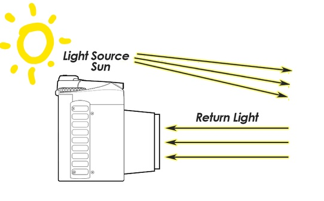

```{r setup, include=FALSE}
options(htmltools.dir.version = FALSE)
library(knitr)
knitr::opts_chunk$set(warning = FALSE, message = FALSE)
# devtools::install_github("hadley/emo")
# devtools::install_github("rstudio/fontawesome")
library(emo)
library(fontawesome) # from github: https://github.com/rstudio/fontawesome
```

layout: true
  
<div class="my-footer"><span>geotecinit.github.io/GISDay2020</span></div>

<!-- this adds the link footer to all slides, depends on my-footer class in css-->

---
name: title
class: left, middle
background-image: url(figs/Sentinel-2A.jpg)
background-size: cover

### .whiteinline[.fancy[Observando desde <br/>el espacio: agricultura <br>y medio ambiente]]

<br/><br/>

.large[.whiteinline[`#`GISDay]]

.large[.whiteinline[`#`EO4GEO]]


<br/><br/><br/>

.right[.large[Carlos Granell & Estefanía Aguilar]]
.right[.large[GEOTEC | INIT | UJI]]
.right[18 noviembre 2020]

<!-- this ends up being the title slide since seal = FALSE-->


---
class: center


---
class: center

.pull-left[
  
]

.pull-right[
  <br/>
  
]

### The Space/Geospatial Sector Skills Alliance

.left[Estrategia innovadora para el desarrollo de .large[habilidades] y .large[capacitación] <br/>en el sector de la información espacial]

.right[`r fontawesome::fa(name = "arrow-circle-right")` Aumentar el número de .large[personas] que utilizan <br/>los datos y la información de Copernicus.]

.right[`r fontawesome::fa(name = "arrow-circle-right")` Aumentar la oferta de .large[habilidades] para estimular <br/>el crecimiento de .large[empleos] relacionados con lo geoespacial en Europa.]


---
class: center, middle


???

Esta charla forma parte de las actividades programadas en la [Semana de la Ciencia](https://www.uji.es/investigacio/base/cultura-cientifica/pc4/acc-divulga/setmana-cienc/), coordinada por el proyecto de [Cultura Científica i Ciencia Ciudadana (PC4)](https://www.uji.es/investigacio/base/cultura-cientifica/pc4/) de la UJI.

---
class: center

### [geotec.uji.es](http://geotec.uji.es/)

<iframe width="1000" height="500" src="http://geotec.uji.es/" frameborder="0" allowfullscreen></iframe>

???

En nuestra web, http://geotec.uji.es/, puedes encontrar las proyectos que hemos hecho o en curso, publicaciones y nuestro blog.

---
class: inverse, middle, center

# .fancy[Antes de empezar]

--

.pull-left[
### .center[.fancy[.cold[vía corta]]]
### .center[.large[`r emo::ji("computer")`]]
]

--

.pull-right[
### .center[.fancy[.heat[vía larga]]]
### .center[.large[`r emo::ji("computer")` + `r fontawesome::fa(name = "link", fill = "white")` + `r fontawesome::fa(name = "keyboard", fill = "white")` + .fancy[`p`]]]
]


???
¡Bien! Estas leyendo las notas de la transparencia. 

Aquí encontrarás enlaces a las fuentes utilizadas, videos explicativos y a otros recursos.

La lista de recursos tambien está en el [repositorio de la presentación](https://github.com/GeoTecINIT/GISDay2020). 

La presentación está disponible en http://geotecinit.github.io/GISDay2020/index.html

Para ocultar las notas, pulsa otra vez `p`. 


<!------------------------->
<!-- BLOQUE INTRODUCCIÓN -->
<!------------------------->
---
class: inverse, center, middle

# GIS Day? `r emo::ji("thinking")`


---
class: center

# ¿Qué se celebra hoy?

--

Día Europeo para la protección de los niños de la explotación sexual

--

Día Mundial de los Record Guinness

--

Día Europeo del uso prudente de antibióticos

--

Día Internacional del Arte Islámico

--

.fat[Día del Sistema de Información Geográfica - GIS Day `r emo::ji("earth")`]


???
El [GIS Day](https://www.gisday.com/) tiene como objetivo **concienciar de la importancia que la geografía desempeña en nuestras vidas**, y promover su conoenti y suo en las escuelas, comunidades y organizaciones. Fuente: [Wikipedia](https://es.wikipedia.org/wiki/GIS_Day)

---


.left-column[
  ### GIS Day & GEOTEC
]

.right-column[
  <iframe width="800" height="600" src="http://geotec.uji.es/tag/gisday/" frameborder="0" allowfullscreen></iframe>
]


---

.left-column[
  ### GIS Day & GEOTEC
  ### GIS Day 2020
]

.right-column[
  
  .center[https://www.gisday.com/]
]

???
Fuente: [www.gisday.com/en-us/overview](https://www.gisday.com/en-us/overview)

---


.left-column[
  ### GIS Day & GEOTEC
  ### GIS Day 2020
]

.right-column[
  .center[]
]

???
https://www.uji.es/estudis/oferta/base/graus/actual/agroalimentaria-p18/

---

.left-column[
  ### GIS Day & GEOTEC
  ### GIS Day 2020
]

.right-column[
  .center[] 
]

???
[Folleto informativo](https://www.uji.es/estudis/oferta/base/graus/actual/agroalimentaria-p18/bin/diptics/diptic.pdf)

---

.left-column[
  ### GIS Day & GEOTEC
  ### GIS Day 2020
]

.right-column[
  .center[] 
]


---

.left-column[
  ### GIS Day & GEOTEC
  ### GIS Day 2020
]

  
.right-column[
  
]


---

.left-column[
  ### GIS Day & GEOTEC
  ### GIS Day 2020
]

  
.right-column[
  
]

---

.left-column[
  ### GIS Day & GEOTEC
  ### GIS Day 2020
]

  
.right-column[
  
  
  **Topografía**: CCR06 - Uso de sistemas de información geográfica y teledetección en agronomía!
]


???
Proceso de captura de datos y recogida de informacion precisa para su analisis y toma de decisiones en vuestro trabajo. Luego, los resultados se evalucion para saber si son correctos. En este flujo, las tecnologias espaciales, los sistemas de información geográfica y remote sensing os pueden ayudar!

Uno de los resultados de aprendizaje de la asignatura de [Topografía](https://ujiapps.uji.es/sia/rest/publicacion/2020/estudio/239/asignatura/AG1820) esta relacionado con el uso de información geográfica y teledetección en agronomía.

<!------------------------->
<!-- BLOQUE PRINCIPAL    -->
<!------------------------->

<!------------------------->
<!-- SECCION GIS         -->
<!------------------------->

---
class: inverse, center, middle

# Tecnologías para agricultura/medio ambiente

--

### .fat[Sistemas Información Geográfica (GIS)] 

???

Primera pregunta ahora!: conocimiento/uso previo de GIS

---
class: center

# .fatinline[GIS & mapas]

.pull-left[
  ### Realidad
  
  
]

--

.pull-right[
  ### Modelo (por capas)
  
  
]

???
No te puedes perder esta mezcla de arte, ciencia y GIS que muestra la contracción de los [glaciares](https://artsexperiments.withgoogle.com/timelines#/) en los últimos 100 años.

---
class: center


???

Ejemplos de herramientas y software GIS

---
class: center, middle

### .fat[A través de los mapas ...]

???
Fuente: [El proyecto social de mapas para el 2020](https://github.com/tjukanovt/30DayMapChallenge). Un tweet en 2019 proponiendo el reto de crear un mapa cada día durante el mes de Noviembre propició que la comunidad SIG se movilizara de forma altruista para crear cientos de mapas de temática diversas. Los 4 mapas siguientes son ejemplos del reto.

---

.left-column[
  ### .fatinline[contamos historias]
]

.right-column[
  .center[]
  
  .right[.small[`#`30DayMapChallenge]]
]

???
Fuente: DAY 10 (BLACK AND WHITE) By Carl Churchill (@Cchurchili). https://david.frigge.nz/30DayMapChallenge/maps/Cchurchili_10.png

Fuente: [30 DAY MAP CHALLENGE - Gallery Map](https://david.frigge.nz/30DayMapChallenge/maps.html)

---
.left-column[
  ### contamos historias
  ### .fatinline[encontramos respuestas]
]

.right-column[
  .center[]
  
  .right[.small[`#`30DayMapChallenge]]
]

???
Fuente: DAY 07 (RED) By Víctor Olaya (@volayaf). https://david.frigge.nz/30DayMapChallenge/maps/volayaf_07.jpg

Fuente: [30 DAY MAP CHALLENGE - Gallery Map](https://david.frigge.nz/30DayMapChallenge/maps.html)

---

.left-column[
  ### contamos historias
  ### encontramos respuestas
  ### .fatinline[o surgen nuevas preguntas]
]

.right-column[
  .center[]

  .right[.small[`#`30DayMapChallenge]]
]

???
Fuente: DAY 06 (BLUE) By Nina Lindell (@ninatsuts). https://david.frigge.nz/30DayMapChallenge/maps/ninatsuts_06.jpg

Fuente: [30 DAY MAP CHALLENGE - Gallery Map](https://david.frigge.nz/30DayMapChallenge/maps.html)

---

.left-column[
  ### contamos historias
  ### encontramos respuestas
  ### o salen nuevas preguntas
  ### .fatinline[tomamos decisiones]
]

.right-column[
  .center[]
  
  .right[.small[`#`30DayMapChallenge]]
]

???
Fuente: DAY 06 (BLUE) By Ignasi Servià (@iservia). https://david.frigge.nz/30DayMapChallenge/maps/iservia_06.jpg

Fuente: [30 DAY MAP CHALLENGE - Gallery Map](https://david.frigge.nz/30DayMapChallenge/maps.html)


---
class: center, middle

### .fat[pero sin datos, no hay mapas]

--

### .fat[ni historias, ]

--

### .fat[ni respuestas, ]

--

### .fat[ni decisiones, ...]

---
background-image: url(figs/i-want-data-now.jpg)
background-size: cover


<!------------------------->
<!-- BLOQUE REMOTE SENSING-->
<!------------------------->

---
class: inverse, center, middle

# Tecnologías de apoyo a la agricultura/medio ambiente

--

### .acid[Remote Sensing (Teledetección)] 


---

.pull-left[

### .center[.acidinline[REMOTE]]

significa que *algo* está fuera (lejos, cerca) de nuestro alcance, que .acid[no lo tocamos físicamente]

]

--

.pull-right[

### .center[.acidinline[SENSING]]

significa .acid[obtener información] sobre ese *algo*

]

???
Fuente: [What is Remote Sensing? Understanding Remote Sensing](https://www.youtube.com/watch?v=N49PzLDUIFQ)


---
class: center, middle

# .acid[REMOTE SENSING]

### obtener datos (propiedades, información) de un objeto (o fenómeno) sin estar en contacto directo o físico con dicho objeto.

???
Fuente: [What is Remote Sensing? Understanding Remote Sensing](https://www.youtube.com/watch?v=N49PzLDUIFQ)

---
class: center
### .acidinline[REMOTE SENSING] está en todos partes...


  

???
Remote Sensing es cotidiano, no va solo de satélites, aunque sean los satélites lo que venga primero a la mente...

---

.left-column[
### .acidinline[Principios básicos]
]

.right-column[
  ### .left[`r fontawesome::fa(name = "arrow-circle-right")` Fuente de .acidinline[luz]]

  ### .left[`r fontawesome::fa(name = "arrow-circle-right")` Objetos .acidinline[absorben] y .acidinline[reflejan] luz]

  ### .left[`r fontawesome::fa(name = "arrow-circle-right")` Detectar la .acidinline[luz reflejada] del objeto (información)]

]


???
Fuente: [What is the Process of Remote Sensing?](https://www.youtube.com/watch?v=-7_0Z_tm2Z8)

---

.left-column[
### Principios básicos
### .acidinline[Passive RS]
]

.right-column[
  .center[]
]


???
Fuente: [Passive vs Active Sensors in Remote Sensing](https://gisgeography.com/passive-active-sensors-remote-sensing/)

¿Y si no hay luz en la habitación donde hacemos la foto o es de noche? Si no hay fuente de luz natural, no hay luz reflejada y por tanto no se captura información (ho hay foto!)


---

.left-column[
### Principios básicos
### Passive RS
### .acidinline[Active RS]
]

.right-column[
  <br/><br/>
  .center[]
]


???
Fuente: [Passive vs Active Sensors in Remote Sensing](https://gisgeography.com/passive-active-sensors-remote-sensing/)


---
class: center
# .acidinline[Passive vs Active] Remote Sensing


???
Trasladamos la idea de active/passive remote sensing para los satelites de observacion de la tierra

---
background-image: url(figs/nasa-apollo8-dec24-earthrise.jpg)
background-size: cover

--

### .center[.whiteinline[Las imágenes de satélites no son sólo fotos]] 


???

Las fotos de la tierra son espectaculares, como [La imagen de la Tierra saliendo sobre la luna en 1968 que lo cambió todo](https://www.nationalgeographic.es/espacio/2018/12/la-imagen-de-la-tierra-saliendo-sobre-la-luna-en-1968-que-lo-cambio-todo). Estamos acostumbrados a ver imégenes de satelites como mapas bases, por ejemplo, cuando utilizamos Google Maps. Sin embargo, hay mucho más que no podemos ver...
---

.left-column[
### Principios básicos
### Passive RS
### Active RS
### .acidinline[Respuesta espectral]
]

.right-column[
  ### .center[Espectro electromagnético]

  
]

---

.left-column[
### Principios básicos
### Passive RS
### Active RS
### .acidinline[Respuesta espectral]
]

.right-column[
  ### .center[Espectro electromagnético (.acidinline[Remote Sensing])]

  
]


---

.left-column[
### Principios básicos
### Passive RS
### Active RS
### .acidinline[Respuesta espectral]
]

.right-column[
  ### .center[1 imagen `r fontawesome::fa(name = "equals")` N .acidinline[bandas espectrales]]
  
  .center[`r fontawesome::fa(name = "arrow-circle-right")` Imagen multiespestral: **pocas** bandas (N `r fontawesome::fa(name="arrow-down")`)]  
  .center[`r fontawesome::fa(name = "arrow-circle-right")` Imagen hiperespectral: **muchas** bandas (N `r fontawesome::fa(name = "arrow-up")`)]  

  <br/><br/>
  
  .center[]
]

???
Fuente: [Bandas de Raster](https://desktop.arcgis.com/es/arcmap/latest/manage-data/raster-and-images/raster-bands.htm)

No te pierdas este video explicativo para entender la firma espectral: [The Basics of Imagery - About Spectral Remote Sensing Data](https://www.youtube.com/watch?v=3iaFzafWJQE)

---

.left-column[
### Principios básicos
### Passive RS
### Active RS
### .acidinline[Respuesta espectral]
]

.right-column[
  ### .center[True color `r fontawesome::fa(name = "equals")` .heatinline[R] `r fontawesome::fa(name = "plus")` .acidinline[G] `r fontawesome::fa(name = "plus")` .coldinline[B]]
  
  
]


???
Fuente: [Work With Multi-Band Rasters in R](https://erinbecker.github.io/r-raster-vector-geospatial/05-raster-multi-band-in-r/index.html)


---

.pull-left[
  ### .acidinline[True color] .small[(tal como lo vemos)]
  
  
]

--

.pull-right[
  ### .heatinline[Infra red] .small[(esto no lo vemos)]
  
  
]


Imagen: Montañas rocosas (US).

.fancy[¡Ojo! las imágenes de satélites tienen .acidinline[bandas], muy similar a la idea de .fatinline[capas]]


???
Fuente: [https://gisgeography.com/passive-active-sensors-remote-sensing/](https://gisgeography.com/passive-active-sensors-remote-sensing/). En la imágen IR (derecha), la vegetación sana se muestra en rojo brillante. áreas urbanas y construidas en blanco brillante. Agua en oscuro. 

---

.left-column[
### Principios básicos
### Passive RS
### Active RS
### .acidinline[Respuesta espectral]
]

.right-column[
  ### .center[Firma espectral de la vegetación]
  
  
]

???
Fuente: [Spectral Vegetation Signature](https://eo4geocourses.github.io/IGIK_Sentinel2-Data-and-Vegetation-Indices/#/8)


---

.left-column[
### Principios básicos
### Passive RS
### Active RS
### .acidinline[Respuesta espectral]
]


.right-column[
  ### .center[vegetación .acidinline[sana] `r fontawesome::fa(name = "not-equal")` vegetación .heatinline[enferma]]
  
  .center[]
]

???
Fuente: [Vegetation indices](https://eo4geocourses.github.io/IGIK_Sentinel2-Data-and-Vegetation-Indices/#/11).

La vegetación sana se refleja fuertemente en el espectro del infrarrojo cercano (NIR) mientras que absorbe mucho en el rojo visible.

---

.left-column[
### Principios básicos
### Passive RS
### Active RS
### .acidinline[Respuesta espectral]
]

.right-column[
  ### .center[**NDVI** .small[Normalized Difference Vegetation Index]]

  .center[
]]

???
Fuente: [Combination of multispectral bands](https://eo4geocourses.github.io/IGIK_Sentinel2-Data-and-Vegetation-Indices/#/17).


NDVI cuantifica la vegetación midiendo la diferencia entre la banda de infrarrojo cercano (que la vegetación refleja mucho) y la luz roja (que la vegetación absorbe)

---

.left-column[
### Principios básicos
### Passive RS
### Active RS
### .acidinline[Respuesta espectral]
]

.right-column[
  ### .center[Valores **NDVI** entre .heatinline[-1] y .acidinline[+1]]

  
]

???
Fuente: [NDVI, ¿qué es y para qué sirve?](https://www.cursosteledeteccion.com/ndvi-que-es-y-para-que-sirve/)

Generalmente, valores de NDVI entre 0.2 y 0.4 corresponden a áreas con vegetación escasa; la vegetación moderada tiende a variar entre 0.4 y 0.6; cualquier cosa por encima de 0.6 indica la mayor densidad posible de hojas verdes.

Hay muchos índices espectrales de vegetación, y cada tipo de planta, cultivo, árbol, tiene una firma espectral única... 

---

.left-column[
### Principios básicos
### Passive RS
### Active RS
### .acidinline[Respuesta espectral]
]

.right-column[
  ### .center[En agricultura, NDVI se utiliza para medir .acidinline[biomasa]]

  
]

???
Fuente: [DRONES EN AGRICULTURA DE PRECISIÓN](https://xn--airdroneespaa-tkb.com/drones-en-agricultura-de-precision/)

---

.left-column[
### Principios básicos
### Passive RS
### Active RS
### Respuesta espectral
### .acidinline[Copernicus]
]

.right-column[

  ###  es el programa de la Unión Europea (+ ESA y EEA) para la .acidinline[Observación de la Tierra]

  
]

???

Fuente: [What is the Copernicus programme](https://youtu.be/MGJss4lDaBo)


---

.left-column[
### Principios básicos
### Passive RS
### Active RS
### Respuesta espectral
### .acidinline[Copernicus]
]

.right-column[

  ###  incluye satélites, estaciones en tierra, y mucho más

  
  
]


---

.left-column[
### Principios básicos
### Passive RS
### Active RS
### Respuesta espectral
### .acidinline[Copernicus]
]

.right-column[

  ### .center[Constelación de Sentinels]

  .center[]
]


---

.left-column[
### Principios básicos
### Passive RS
### Active RS
### Respuesta espectral
### .acidinline[Copernicus]
]

.right-column[

  ### .center[Servicios y productos temáticos]

  
]


---

.left-column[
### Principios básicos
### Passive RS
### Active RS
### Respuesta espectral
### .acidinline[Copernicus]
]

.right-column[

  ### Land Monitoring Service
  
  .left[`r fontawesome::fa(name = "link")` .large[http://land.copernicus.eu]]
  
  .left[`r fontawesome::fa(name = "arrow-circle-right")` [ESA Sentinel online](https://sentinels.copernicus.eu/web/sentinel/home)]
  
  .left[`r fontawesome::fa(name = "arrow-circle-right")` [Copernicus Open Access Hub](https://scihub.copernicus.eu/) >> Open Hub]
  
  .left[`r fontawesome::fa(name = "arrow-circle-right")` [Sentinel-hub EO-Browser](https://apps.sentinel-hub.com/eo-browser/)]

]

???
Fuente: [Land Monitoring Service](https://land.copernicus.eu/)

Fuente: [EO4GEO: Copernicus Service Land](https://eo4geocourses.github.io/GEOF_Copernicus-Service-Land/#/)


---

.left-column[
### Principios básicos
### Passive RS
### Active RS
### Respuesta espectral
### .acidinline[Copernicus]
]

.right-column[

  ### Sentinel services for agriculture

  <iframe src="https://www.youtube.com/embed/w_TACzzpVI0" width="800" height="400" frameborder="0" allow="fullscreen" allowfullscreen></iframe>  

]

???

[Sentinel-2 short introduction](https://www.youtube.com/watch?v=Bv3pB9TaWOk)

[Sentinel services for agriculture](https://www.youtube.com/watch?v=w_TACzzpVI0)

[Earth from Space: Planted patchwork](https://www.youtube.com/watch?v=Rx6rwCkV0R4)


---
class: center


https://chrieke.medium.com/map-of-geospatial-companies-ea9ec3a8a87c"

<!------------------------->
<!-- BLOQUE PROYECTOS GEO-->
<!------------------------->

---
class: inverse, center, middle

# Tecnologías de apoyo a la agricultura/medio ambiente

--

### .cold[Ejemplos GEOTEC] 

---

.left-column[
### .coldinline[SEnviro]
]

.right-column[
  ### Estaciones meteorológicas de bajo coste
  
  .left[`r fontawesome::fa(name = "link")` .large[http://geotec.uji.es/projects/senviro/]]

  
  .center[]

]

???
Fuente: [SEnviro website](http://geotec.uji.es/projects/senviro/)


---

.left-column[
### .coldinline[SEnviro]
]

.right-column[
  ### Estaciones meteorológicas de bajo coste
  
  .center[]

]

???
Fuente: [SEnviro website](http://geotec.uji.es/projects/senviro/)

---

.left-column[
### SEnviro
### .coldinline[ERMES]
]

.right-column[
  ### Monitorización/alerta cultivo arroz: .coldinline[nivel regional]
  
  .left[`r fontawesome::fa(name = "link")` .large[http://geotec.uji.es/projects/ermes/]]
  
  <iframe src="https://www.youtube.com/embed/qUCRJOcKsgQ" width="800" height="400" frameborder="0" allow="fullscreen" allowfullscreen></iframe>
]

???
Fuente: [ERMES website](http://geotec.uji.es/projects/ermes/)

---

.left-column[
### SEnviro
### .coldinline[ERMES]
]

.right-column[
  ### Monitorización/alerta cultivo arroz: .coldinline[nivel local]
  
  .left[`r fontawesome::fa(name = "link")` .large[http://geotec.uji.es/projects/ermes/]]
  
  <iframe src="https://www.youtube.com/embed/HMmeURaR50o" width="800" height="400" frameborder="0" allow="fullscreen" allowfullscreen></iframe>

  
]

???
Fuente: [ERMES website](http://geotec.uji.es/projects/ermes/)


<!------------------------->
<!-- BLOQUE CIERRE       -->
<!------------------------->
---
class: inverse, center, middle

# Y terminamos...

---
class: center, middle

### .fancy[Para la agricultura,]

### .fancy[.fat[GIS] y .acid[Remote Sensing]]

### .fancy[son de gran ayuda en la .large[recogida de datos], en el .large[análisis], y en la .large[validación] de resultados.]


---
class: center, middle, inverse

### .fancy[Pero nos hemos dejado .large[.heatinline[drones]] para imágenes de .large[.heatinline[alta resolución]].]

---
class: center

### .fancy[¡Beneficiarios de  como usuarios finales!]


???
No es necesario saber programar o ser un gurú de los ordenadores y procesamiento de imágenes de satélites. Lo imporante es saber donde podéis encontar información relevante para vuestro problemay tomar las decisiones y acciones más acertadas. 

---
class: center, middle, inverse

### .fancy[Tampoco hemos visto .large[.heatinline[sensores in situ]] para agricultura de .large[.heatinline[precisión]] y .large[.heatinline[datos abiertos]] sobre agricultura.]

???
Segunda pregunta aquí: utilidad/interés en el tema

---
class: center, middle

### .fancy[¡.cold[GEOTEC]]

### .fancy[puede ayudaros a conocer más sobre la aplicación de tecnologías ]

### .fancy[.fat[GIS] y .acid[Remote Sensing]]

### .fancy[a vuesto campo!]


---
class: center, middle

### ¿Materiales para saber más?

.large[http://www.eo4geo.eu/training/image-processing-and-analysis/]

### ¿Más? Muy pronto en


.large[http://www.eo4geo.eu/]

???
[Research and User Support (RUS) Copernicus Training programme](https://www.youtube.com/channel/UCB01WjameYMvL7-XfI8vRIA/videos): Algunos de agricultura

[Copernicus MOOC](https://mooc.copernicus.eu/)
---
class: middle

.pull-left[
  .right[
  ### Find GEOTEC at...
  
  [`r fontawesome::fa(name = "link")` geotec](http://geotec.uji.es/)  
  
  ### Find me at...
  
  [`r fontawesome::fa(name = "github")` @cgranell](http://github.com/cgranell)  
  [`r fontawesome::fa(name = "link")` carlosgranell.eu](https://carlosgranell.eu)  
  [`r fontawesome::fa(name = "paper-plane")` carlos.granell@uji.es](mailto:carlos.granell@uji.es)
]]

.pull-right[
  ### Find slides at...
  
  [`r fontawesome::fa(name = "link")` geotecinit.github.io/GISDay2020](https://geotecinit.github.io/GISDay2020/index.html)  
  
  ### Find sources at...
  
  [`r fontawesome::fa(name = "github")` github.com/GeoTecINIT/GISDay2020](https://github.com/GeoTecINIT/GISDay2020)  
]

